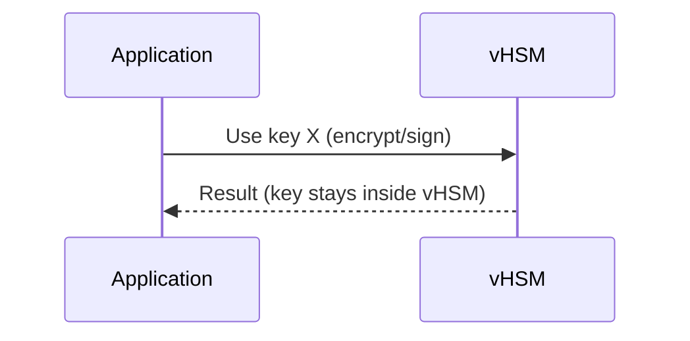
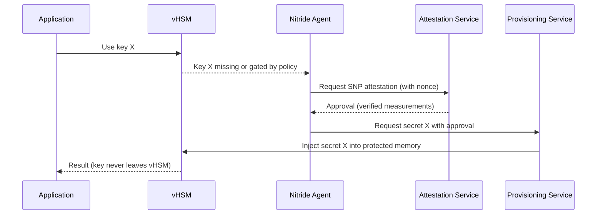

# Confidential Computing + AMD SEV-SNP + vHSM (Summary)

Confidential Computing keeps data safe while it’s being used, not just at rest or in transit. It runs sensitive code inside a Trusted Execution Environment (TEE) or enclave.

## TEE in Action

- Memory Encryption: RAM inside the enclave is encrypted.
- Attestation: Proves the enclave is authentic and running trusted code.
- Confidential Boot: Only verified components load before the enclave starts.
- Sealing/Binding: Data is encrypted so only that enclave/device can use it.
- Secret Provisioning: Keys are delivered directly into the enclave without exposure.

“Encrypted RAM + Proof + Safe Start + Locked Data + Hidden Keys” = TEE in action.

## AMD SEV-SNP (Secure Encrypted Virtualization - Secure Nested Paging)

- Memory encryption: All VM memory is encrypted by CPU.
- Integrity protection: Stops memory rollback or tampering.
- Secure nested paging: Hypervisor cannot map or access VM memory.
- Attestation: Remote verification that VM runs inside a protected enclave.

### How it works

- VM memory and CPU registers are encrypted automatically.
- CPU enforces access rules via RMP and page validation.
- Hypervisor or host cannot access VM memory (even VMPL0).
- Remote attestation proves VM runs securely inside SEV-SNP.

## vHSM’s Role

- Acts as a secure key vault inside the VM.
- Keys are generated and stay inside the vHSM; they never leave protected memory.
- SEV-SNP ensures vHSM memory is encrypted and tamper-proof.
- Applications request keys from vHSM; hypervisor or cloud provider cannot read them.

## When do you need attestation?

- Not needed for intra-VM calls: If the application is inside the same VM and the key is already present in vHSM (and your policy allows), the app can use it directly. No attestation step is required for that local use.
- Needed for external secrets or gated policies: If a key must be released by an external KMS/provisioning service, or your policy requires proving VM trust before generating/using the key, Nitride performs attestation first.

## Case A: Key already in vHSM (no attestation needed)



## Case B: Key missing or policy requires attestation (Nitride verifies)



Notes:
- In Case A, only local access controls apply (e.g., socket ACLs, mTLS, process/cgroup identity). No remote attestation needed.
- In Case B, Nitride handles attestation and secret provisioning. The app still never sees raw keys; they remain in vHSM memory.

# LUKS Unlock with SEV-SNP, Nitride, and vHSM (Example Schema)

This schema shows how a LUKS/dm-crypt root or data volume is unlocked only after SEV-SNP attestation, using Nitride as the in-VM agent and vHSM as the secure key vault.

## Flow: Boot-time LUKS unlock via remote KMS

```mermaid
sequenceDiagram
    autonumber
    participant Boot as Init/Systemd
    participant Nitride as Nitride Agent
    participant vHSM as vHSM
    participant Attest as Attestation Service
    participant KMS as Provisioning Service
    participant LUKS as dm-crypt/LUKS
    Boot->>Nitride: Need LUKS master key to unlock volume
    Nitride->>Attest: Request SEV-SNP attestation (report with nonce)
    Attest-->>Nitride: Attestation OK (verified measurements/TCB)
    Nitride->>KMS: Present approval and request LUKS key
    KMS-->>vHSM: Inject LUKS key into vHSM protected memory
    vHSM-->>Nitride: Key available (never leaves vHSM to userland)
    Nitride->>LUKS: Program dm-crypt with key via privileged interface
    LUKS-->>Boot: Volume unlocked; continue boot
```

Key points:
- The LUKS master key is released only after attestation succeeds.
- The key is delivered into vHSM and never exposed to regular userland processes.
- Nitride performs the attestation and requests the key; a privileged path programs dm-crypt (e.g., systemd-cryptsetup integration).

## Alternative Flow: Sealed local key (no remote KMS)

```mermaid
sequenceDiagram
    autonumber
    participant Boot as Init/Systemd
    participant Nitride as Nitride Agent
    participant vHSM as vHSM
    participant LUKS as dm-crypt/LUKS
    Boot->>Nitride: Need LUKS master key to unlock volume
    Nitride->>Nitride: Perform SEV-SNP attestation (verify policy locally)
    alt Attestation verified
        vHSM->>vHSM: Unseal LUKS key (bound to SNP measurements/policy)
        vHSM-->>Nitride: Key available (inside vHSM)
        Nitride->>LUKS: Program dm-crypt with key via privileged interface
        LUKS-->>Boot: Volume unlocked; continue boot
    else Attestation failed
        Nitride-->>Boot: Deny unlock (key remains sealed)
    end
```

Implementation hints:
- Use a small privileged helper (e.g., systemd-cryptsetup hook or a custom unit) that asks Nitride for the key and passes it to dm-crypt without logging or persisting it.
- For remote KMS, define a policy mapping volume identity → key ID; Nitride requests that key after attestation.
- For sealed keys, bind the sealed blob to SEV-SNP measurements (OVMF, kernel/initramfs hashes, policy flags) so only the approved VM state can unseal.
