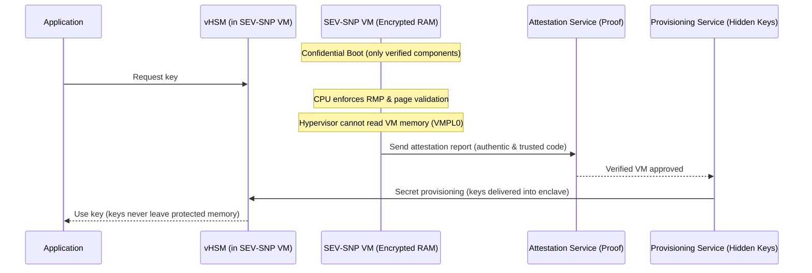

# Confidential Computing + AMD SEV‑SNP + vHSM (Summary)

Confidential Computing is a way to keep data safe while the CPU is using it, not only when it’s stored or sent.

It fixes this by running the sensitive code and data inside a private, protected zone in the processor called a TEE (Trusted Execution Environment) or enclave.

## TEE in Action

- Memory Encryption: The enclave keeps its RAM data encrypted so nobody outside can read it.
- Attestation: The enclave proves it’s authentic and running trusted code.
- Confidential Boot: The system only loads verified components before the enclave starts.
- Sealing/Binding: Data is encrypted so only that specific enclave or device can use it.
- Secret Provisioning: Keys are delivered straight into the enclave without exposure.

“Encrypted RAM + Proof + Safe Start + Locked Data + Hidden Keys” = TEE in action.

## AMD SEV‑SNP (Secure Encrypted Virtualization – Secure Nested Paging)

1. Memory encryption – All VM memory is automatically encrypted by CPU.
2. Integrity protection – Prevents attacks like memory rollback or tampering.
3. Secure nested paging – Ensures the hypervisor cannot map or access VM memory.
4. Attestation – You can verify remotely that the VM is running securely inside a protected enclave.

### HOW-works

- VM memory + registers are encrypted automatically.
- CPU checks every memory access using RMP & page validation.
- Hypervisor or host cannot access VM memory even at the lowest privilege level (VMPL0).
- Remote attestation can prove that VM is running securely inside SEV-SNP protected environment.

## vHSM’s Role

- It acts like a secure key vault inside the VM.
- Keys are generated and stored inside the vHSM, never leaving the protected memory.
- SEV‑SNP ensures the memory containing the vHSM and its keys is encrypted and tamper-proof.
- When your application needs a key, it talks to the vHSM inside the VM. Even the hypervisor or cloud provider cannot read these keys.

---

## Schema: Attestation and Key Provisioning Flow

