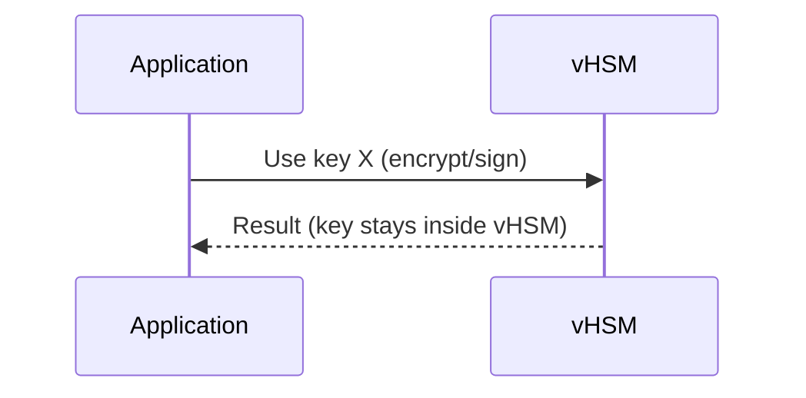
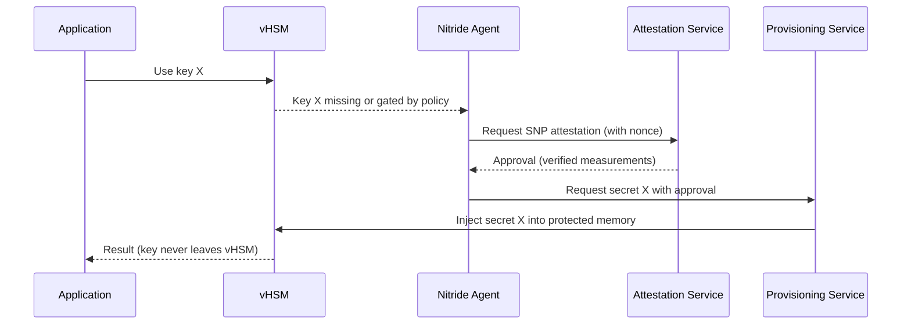

# Confidential Computing + AMD SEV-SNP + vHSM (Summary)

Confidential Computing keeps data safe while it’s being used, not just at rest or in transit. It runs sensitive code inside a Trusted Execution Environment (TEE) or enclave.

## TEE in Action

- Memory Encryption: RAM inside the enclave is encrypted.
- Attestation: Proves the enclave is authentic and running trusted code.
- Confidential Boot: Only verified components load before the enclave starts.
- Sealing/Binding: Data is encrypted so only that enclave/device can use it.
- Secret Provisioning: Keys are delivered directly into the enclave without exposure.

“Encrypted RAM + Proof + Safe Start + Locked Data + Hidden Keys” = TEE in action.

## AMD SEV-SNP (Secure Encrypted Virtualization - Secure Nested Paging)

- Memory encryption: All VM memory is encrypted by CPU.
- Integrity protection: Stops memory rollback or tampering.
- Secure nested paging: Hypervisor cannot map or access VM memory.
- Attestation: Remote verification that VM runs inside a protected enclave.

# How AMD SEV-SNP Works

## 1. VM Memory and CPU Registers Are Encrypted Automatically
- SEV-SNP encrypts all VM RAM using a hardware key stored inside the AMD CPU.
- Even if the hypervisor tries to read the VM’s RAM, it only sees encrypted data.
- CPU registers are also encrypted whenever the VM is paused or switched, so the host cannot see them.

## 2. CPU Enforces Access Rules via RMP (Reverse Map Table) and Page Validation
- What is the RMP?
  - A hardware-maintained table inside the CPU that records, for every physical page, who “owns” it (which VM), what permissions apply, and which VM privilege level (VMPL) is allowed to access it.
- How checks happen:
  - On every memory access, the CPU consults the RMP to ensure the requester (VM + VMPL) matches the page’s recorded owner and permissions.
  - If the mapping is inconsistent (e.g., hypervisor remaps a page it doesn’t own, or a VM at the wrong VMPL tries to access it), the CPU blocks the access.
- Page validation:
  - SEV-SNP adds page state and integrity metadata so pages can’t be injected, replayed, or reused incorrectly.
  - Transitions (e.g., assigning a page to a VM, changing permissions) require explicit validation operations; the CPU updates the RMP and enforces correctness.

## 3. Hypervisor or Host Cannot Access VM Memory (Even at VMPL0)
- VMPL overview:
  - VMPL are hardware-enforced privilege levels inside a VM context, separate from classic x86 rings (CPL). They let a VM run multiple components at different trust levels while keeping the hypervisor outside of that trust boundary.
- Difference between VMPL0 and VMPL1:
  - VMPL0: The highest privilege level within the VM. Typically reserved for the most trusted code (e.g., secure monitor, minimal trusted runtime). It can perform sensitive operations like configuring protections for lower VMPLs and managing certain SNP instructions for page state transitions.
  - VMPL1: A lower privilege level within the VM, often where the main OS kernel or critical services run. VMPL1 has broad capabilities to operate the OS but is restricted from actions reserved to VMPL0 (e.g., changing RMP ownership without authorization).
- Why the hypervisor is blocked:
  - The hypervisor does not run at any VMPL for the guest VM; it’s outside the VM’s protected context. RMP entries mark pages as owned by the VM, so any host/hypervisor access fails the RMP ownership/permission checks. Hardware returns faults or only ciphertext, preventing plaintext reads.

## 4. Remote Attestation Proves the VM Runs Securely Inside SEV-SNP
- The VM can generate a signed attestation report from the AMD Security Processor.
- This report contains measurements of the VM’s initial state (bootloader, kernel, configs).
- External services (like Nitride, KMS, or a provisioning service) verify the report before sending secrets.
- This ensures only a genuine, untampered Confidential VM receives sensitive data.

## vHSM’s Role

- Acts as a secure key vault inside the VM.
- Keys are generated and stay inside the vHSM; they never leave protected memory.
- SEV-SNP ensures vHSM memory is encrypted and tamper-proof.
- Applications request keys from vHSM; hypervisor or cloud provider cannot read them.

## When do you need attestation?

- Not needed for intra-VM calls: If the application is inside the same VM and the key is already present in vHSM (and your policy allows), the app can use it directly. No attestation step is required for that local use.
- Needed for external secrets or gated policies: If a key must be released by an external KMS/provisioning service, or your policy requires proving VM trust before generating/using the key, Nitride performs attestation first.

## Case A: Key already in vHSM (no attestation needed)

## Case B: Key missing or policy requires attestation (Nitride verifies)

Notes:
- In Case A, only local access controls apply (e.g., socket ACLs, mTLS, process/cgroup identity). No remote attestation needed.
- In Case B, Nitride handles attestation and secret provisioning. The app still never sees raw keys; they remain in vHSM memory.

Nitride – Role 
Nitride is a VM-resident agent that acts as the bridge between vHSM and external secret sources.

Its main functions:
Attestation: Proves to the provisioning service that the VM is running securely inside a SEV-SNP enclave.
Secret Request: Once attestation succeeds, Nitride requests the needed secret/key (e.g., LUKS passphrase, API key) from the external provisioning service.
Secure Injection: Delivers the secret directly into vHSM’s protected memory—keys never leave the enclave.

 “Nitride = the secure messenger that proves trust and fetches secrets.”

In Case A: Nitride does nothing because the key already exists.
In Case B: Nitride ensures that only a verified, trusted VM receives secrets.
