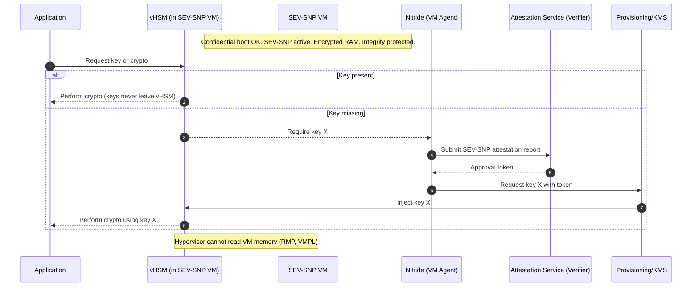

# Confidential Computing + AMD SEV-SNP + vHSM (Summary)

Confidential Computing keeps data safe while it’s being used, not just at rest or in transit. It runs sensitive code inside a Trusted Execution Environment (TEE) or enclave.

## TEE in Action

- Memory Encryption: RAM inside the enclave is encrypted.
- Attestation: Proves the enclave is authentic and running trusted code.
- Confidential Boot: Only verified components load before the enclave starts.
- Sealing/Binding: Data is encrypted so only that enclave/device can use it.
- Secret Provisioning: Keys are delivered directly into the enclave without exposure.

“Encrypted RAM + Proof + Safe Start + Locked Data + Hidden Keys” = TEE in action.

## AMD SEV-SNP (Secure Encrypted Virtualization – Secure Nested Paging)

- Memory encryption: All VM memory is encrypted by CPU.
- Integrity protection: Stops memory rollback or tampering.
- Secure nested paging: Hypervisor cannot map or access VM memory.
- Attestation: Remote verification that VM runs inside a protected enclave.

### How it works

- VM memory & CPU registers are encrypted automatically.
- CPU enforces access rules via RMP & page validation.
- Hypervisor or host cannot access VM memory (even VMPL0).
- Remote attestation proves VM runs securely inside SEV-SNP.

## vHSM’s Role

- Acts as a secure key vault inside the VM.
- Keys are generated and stay inside the vHSM; they never leave protected memory.
- SEV-SNP ensures vHSM memory is encrypted and tamper-proof.
- Applications request keys from vHSM; hypervisor or cloud provider cannot read them.

## Attestation & Key Provisioning Flow (with Nitride)

